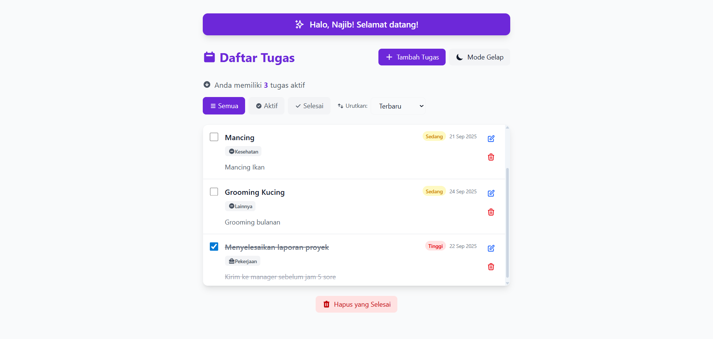
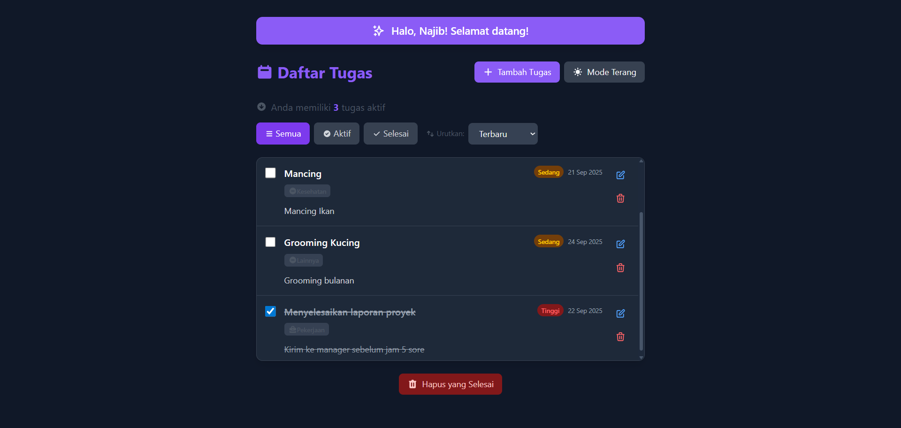
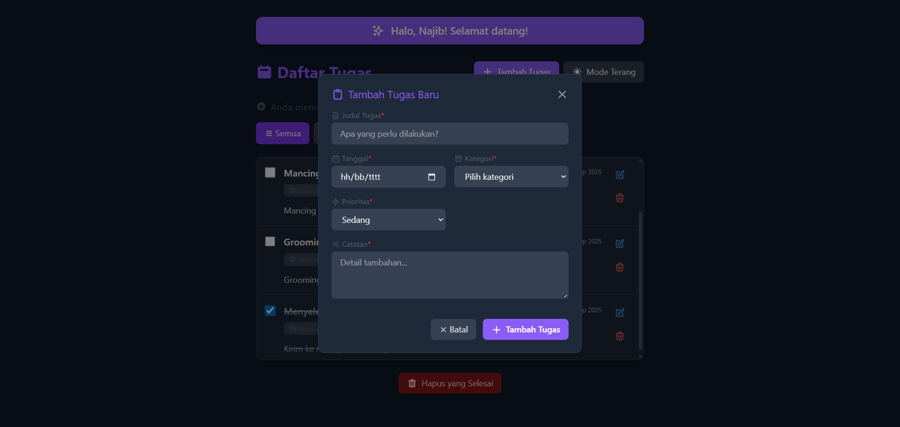

# ✅ Aplikasi Todo List

Aplikasi web sederhana untuk mengelola tugas sehari-hari dengan **antarmuka modern, responsif, dan dukungan tema gelap/terang**.  
Proyek ini dibuat dengan **HTML, Tailwind CSS, dan JavaScript (ES6+)** serta memanfaatkan **Local Storage API** untuk menyimpan data secara lokal di browser.

---

## ✨ Fitur Utama

- ✅ Simpan nama user
- ✅ Tambah, edit, dan hapus tugas
- ✅ Tandai tugas selesai dengan checkbox
- ✅ Filter tugas: **Semua, Aktif, Selesai**
- ✅ Sortir tugas: **Terbaru, Terlama, A–Z, Z–A, Jatuh Tempo, Prioritas**
- ✅ 🌙 Tema **gelap/terang** dengan toggle button
- ✅ Validasi form input (judul, tanggal, kategori, catatan)
- ✅ Penyimpanan data lokal menggunakan **Local Storage API**
- ✅ Desain **responsif** untuk desktop & mobile

---

## 🛠 Teknologi

- **HTML5** – struktur halaman
- **CSS3 + Tailwind CSS** – styling modern & responsif
- **JavaScript (ES6+)** – logika aplikasi (CRUD, filter, sort, modal, dll.)
- **Local Storage API** – simpan data tugas di browser

---

## 📸 Screenshots

### 🌞 Tampilan Mode Terang

### 🌙 Tampilan Mode Gelap

### ➕ Form Tambah Tugas

---

## 🚀 Demo

Aplikasi ini bisa dicoba langsung di GitHub Pages:  
👉 [Todo List App](https://narujib.github.io/CodingCamp-150925-najib/)
